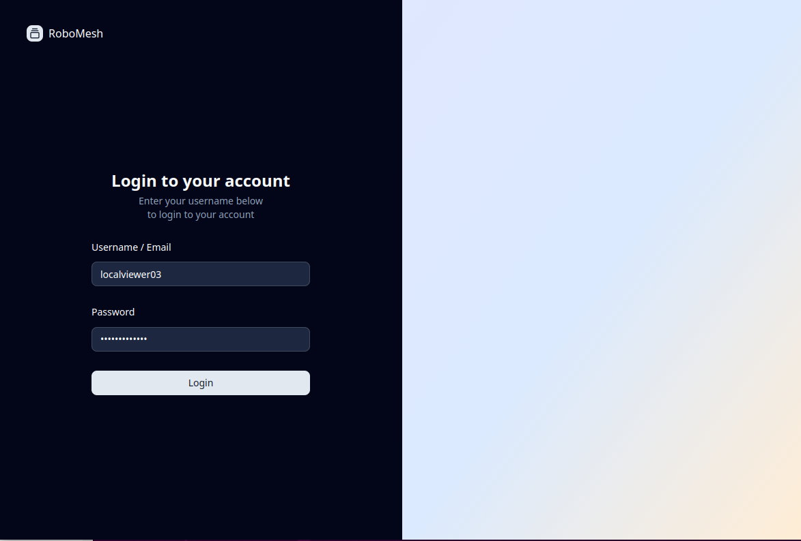
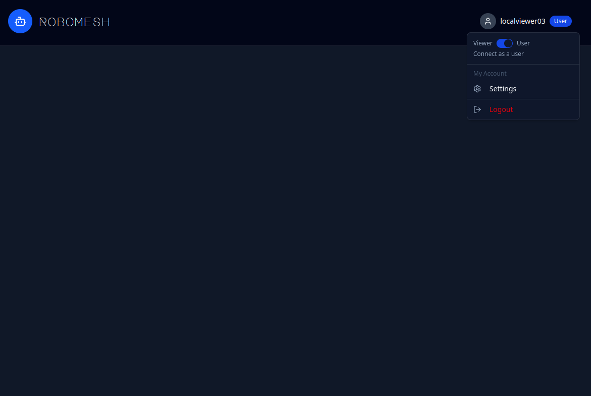
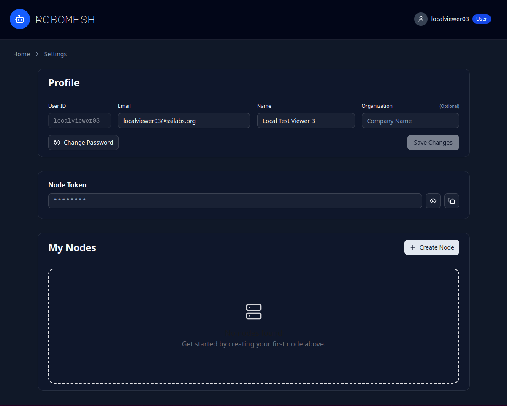
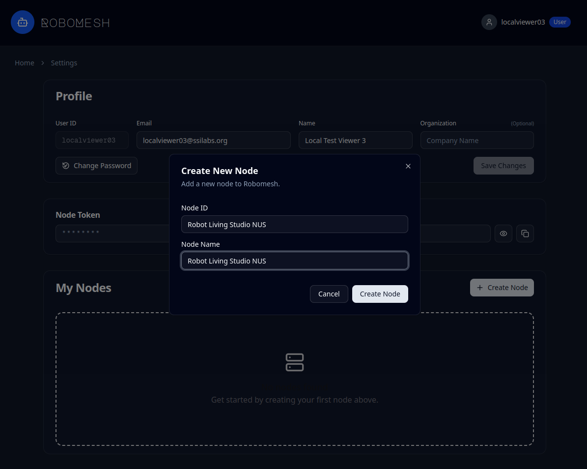
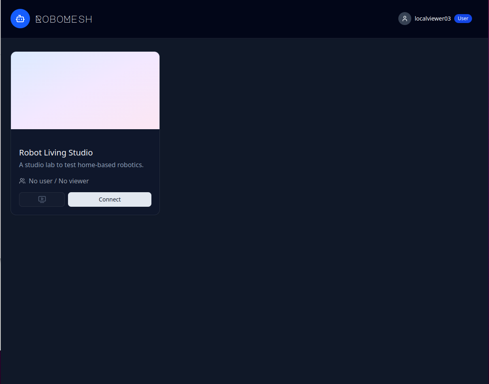

# RoboMesh-WebRTC-Server
This is a WebRTC-based communication interface (implemented with a Go WebRTC server) for the RoboMesh Platform, which hosts online interactive robot demonstrations. It was developed by the Adaptive Computing Lab at the National University of Singapore (NUS).

## 0. Prerequisites

### Account Setup

To host this server, you need to have an account on the RoboMesh platform. We only offer this to selected labs and organizations. If you are interested in hosting an online interactive robot demo, please contact us at dyhsu@comp.nus.edu.sg, zhanghb@comp.nus.edu.sg, and anxingx@comp.nus.edu.sg.

### Getting Started with RoboMesh Platform

Once you have an account, follow these steps to set up your node:

**Step 1: Login to RoboMesh**

Visit the RoboMesh platform and log in with your credentials. 



**Step 2: Access Settings**

Click on your username in the top-right corner and select "Settings" from the dropdown menu.



**Step 3: View Your Profile and Token**

In the Settings page, you'll see:
- Your **Node Token** - This is your `WS_QUERY_TOKEN` for the `.env` file (click the eye icon to reveal it)
- **My Nodes** section where you can manage your streaming nodes



**Step 4: Create a New Node**

Click the "**+ Create Node**" button to create a new streaming node. Enter:
- **Node ID**: A unique identifier for your node (e.g., "Robot Living Studio NUS")
- **Node Name**: A display name for your node



**Important:** Copy your **Node Token**, and **Node ID** - you'll need these for the `.env` configuration in Section 2.

## 1. Setup Golang

This project requires **Go 1.22.5 or higher**.

#### Ubuntu Installation

Install the latest Go version via snap:

```bash
sudo snap install go --classic
```

Verify Installation

```bash
go version
```

Navigate to the project directory and install Go dependencies:

```bash
git clone https://github.com/AdaCompNUS/RoboMesh_Server.git
cd RoboMesh_Server/ && go mod download
```

## 2. Config your channel

You will need to create a new .env file for your node. You can use the .env.example as a template.

```bash
cp .env.example .env
```

Then, you need to fill in the following information in the .env file:

```bash
NODE_ID=XXXXXX
NODE_TOKEN=XXXXXX
```

All configurable channel information is in the **.env** file. 

**Check your streaming ports:**
If you run the video stream, robot application, and (optionally) the audio stream on the same machine, simply make sure the **5004/5006** ports are not in use.

If they are already occupied, choose different available ports and update **.env** file accordingly.
```bash
# RTP Stream Configuration
RTP_VIDEO_PORT=5004 # the port of the machine that is streaming the video
RTP_AUDIO_PORT=5006 # the port of the machine that is streaming the audio
```

**Advanced configuration:** you can follow the detailed description of **.env** file below to do advanced configurations.


## 3. Video Stream

The server receives VP8-encoded video via RTP on port **5004** by default.

### Start Video Stream from Webcam

HOW TO SETUP AND FIND A WEBCAM STREAMING IN UBUNTU? NEED TO CONFIRM

Use ffmpeg to stream video from a webcam device or OBS stream virtual camera (e.g., `/dev/video2`): 

```bash
ffmpeg -i /dev/video2 -an -vcodec libvpx -cpu-used 5 -deadline 1 -g 10 -error-resilient 1 -auto-alt-ref 1 -f rtp rtp://127.0.0.1:5004?pkt_size=1500
```

**Parameters:**
- `-i /dev/video2` - Input video device or RTMP URL
- `-an` - No audio (video only)
- `-vcodec libvpx` - VP8 codec (required for WebRTC)
- `-cpu-used 5` - Speed optimization (higher = faster, lower quality)
- `-deadline 1` - Realtime encoding
- `-g 10` - Keyframe interval (10 frames)
- `-error-resilient 1` - Error resilience for packet loss
- `-auto-alt-ref 1` - Improve video quality
- `-f rtp` - Output format RTP
- `pkt_size=1500` - Maximum packet size (MTU)

### Start Video Stream from ROS Topic

Use the provided script to stream a ROS image topic (e.g., a Gazebo or robot camera)
to the WebRTC server via RTP.

**STEP 1**: Start the ROS master and the camera publisher.

**STEP 2**: Check whether YOUR_ROS_TOPIC_TO_STREAMING works:
```bash
rosrun image_view image_view image:=YOUR_ROS_TOPIC_TO_STREAMING
```
Ideally, you should see the streaming locally.

**STEP 3**: Run the streaming script with the image topic name:
```bash
python ros_to_ffmpeg.py YOUR_ROS_TOPIC_TO_STREAMING --fps 15
```

### Start Video Stream from mutiple cameras

If you need to stream multiple cameras, you can use OBS to combine them into a single stream. For cameras publishing as ROS topics, you can display them in separate windows and then add each as a window capture source in OBS. After that, the remaining setup is the same as for streaming a single camera.

## 3. Audio Stream  (Optional)

The server receives Opus-encoded audio via RTP on port **5006** by default.

### Start Audio Stream

#### Setup Virtual Audio Devices (Optional)

If you need to capture system audio or create virtual audio routing, set up PulseAudio virtual devices:

```bash
# Create a virtual speaker (null sink)
pactl load-module module-null-sink sink_name=virtual_speaker sink_properties=device.description="virtual_speaker"

# Create a virtual microphone that monitors the virtual speaker
pactl load-module module-remap-source master="virtual_speaker.monitor" source_name="virtual_mic" source_properties=device.description="virtual_mic"
```

This allows you to redirect application audio (e.g. the generated audio from the robot) to the virtual speaker


#### Stream Audio via ffmpeg

```bash
ffmpeg -f alsa -i default -ar 48000 -c:a libopus -b:a 96k -f rtp rtp://127.0.0.1:5006?pkt_size=1500
```


**Parameters:**
- `-f alsa -i default` - ALSA audio input (default audio device)
- `-ar 48000` - Audio sample rate 48kHz (WebRTC standard)
- `-c:a libopus` - Opus codec (required for WebRTC)
- `-b:a 96k` - Audio bitrate 96kbps (good quality for voice/music)
- `-f rtp` - Output format RTP
- `pkt_size=1500` - Maximum packet size (MTU)


## 4. Interface Code Dependencies

The Python interface (`interfaces/ros_interface.py` and `interfaces/ros2_interface.py`) serve as a interface between golang server and ROS.

### Python Dependencies

```bash
pip install flask
```

### ROS Dependencies

The interface requires ROS with the following packages:
- `rospy` - ROS Python client library
- `std_msgs` - Standard ROS messages
- `geometry_msgs` - Geometry messages for point data

For ROS2, you need to install the following packages:
- `rclpy` - ROS Python client library
- `std_msgs` - Standard ROS messages
- `geometry_msgs` - Geometry messages for point data

### ROS Topics

**Publishers:**
- `/user_instruction` (String) - User chat messages sent to robot
- `/user_point` (Point32) - User pointing events sent to robot

**Subscribers:**
- `/robot_feedback` (String) - Robot feedback messages to relay back to user

'end' is a special message to indicate that the task is complete. This is for stopping the blocking of the website interface. If you help the website interface to be able to interact with the robot during execution of the task, you can send this message at the beginning of the task.

### Configuration

Edit `interface.py` to configure:
- `self.target_ip` - IP address of the Go WebRTC server (default: `127.0.0.1`)
- `self.target_port` - TCP port for receiving messages (default: `8080`)
- `self.lefttop` / `self.rightbottom` - Screen coordinate calibration (This is usefull when you have multiple cameras but only one of them is interactable)

If you don't want to use ROS, you can configure the interface by your own code.

## 5. Running

### Start the System

**Terminal 1: Start Video Stream**

If you use ffmpeg to streaming your webcam:
```bash
ffmpeg -i /dev/video2 -an -vcodec libvpx -cpu-used 5 -deadline 1 -g 10 -error-resilient 1 -auto-alt-ref 1 -f rtp rtp://127.0.0.1:5004?pkt_size=1500
```

If you want to stream your ROS topic:
```bash
python ros_to_ffmpeg.py YOUR_ROS_TOPIC_TO_STREAMING --fps 15
```

**Terminal 2: Start Audio Stream** (optional)

```bash
ffmpeg -f alsa -i default -ar 48000 -c:a libopus -b:a 96k -f rtp rtp://127.0.0.1:5006?pkt_size=1500
```


**Terminal 3: Start Go WebRTC Server**

```bash
go run main.go
```

**Terminal 4: Start Python Interface**

For ROS1:
```bash
python interfaces/ros_interface.py
```

For ROS2:
```bash
python interfaces/ros2_interface.py
```

**Terminal 5: Run the example ROS1 or ROS2 application**

```bash
python examples/example_ros.py
```

For ROS2:
```bash
python examples/example_ros2.py
```

## 6. Connect to RoboMesh Platform

**Connect to Your Node**

After creating the node, you'll see it in your node list. You can connect to it from the viewer interface.


